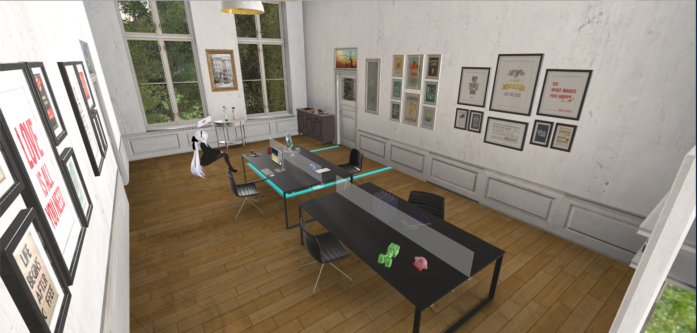

# 10.0 ~ 11.1 (Project Haku II)

# Opening 場景

* 小幅度修正光影，柔和一點點點 (我也忘了我到底有沒有調過啦)

# Minecraft 場景

* 修正 Minecraft 特殊行為 造成的 bug
	
		* 特殊行為: 在目前 Trigger 為按住情況下，另一手把靠近按下Trigger，接著再放開目前Trigger 的行為)

		* 修正 Bug: 9.9 以前 Minecraft 武器快速換手會有音樂沒有撥放的bug

		* 修正 Bug: 小機率因此無法砍傷怪物的bug

* 修正 Minecraft 劍 拿否砍傷怪物的設計

		* 修正前：只有鑽石劍可以攻擊, 使用劍上Canvas 的 攻擊力 暗示這一點

		* 修正後: 所有劍都可以攻擊

		* 然而這樣使用鑽石劍的風險更大，因此在計算分數上採有倍率制，Canvas 亦顯示倍率

		* 鑽石劍倍率: 2 倍，其他的劍: 1 倍

		* 拿掉 Minecraft 場景 Ipad 最後一頁的教學圖片 ("並不是所有劍都能傷到怪物喔")

* 延遲進入傳送門之後 開始遊戲的時間

		* 修改前：直接開始遊戲 + 跑 GameStart UI 動畫

		* 修改後：跑 GameStart UI 動畫，動畫結束後幾秒 (用 yield 實作) 才開始遊戲

* 更改苦力怕重生位置，重生點數量從 8 個 減少到 6 個，另外調整位置離重生點比較遠，避免進入傳送門後有機率馬上遭遇怪物

* 調整 Minecraft 遊玩時間

		* 修改前：30 秒

		* 修改後：45 秒

# BeforeLunchOffice 場景

OLD

NEW

* 加入燈泡 + 很微量的 Bloom，雖然到 Bloom 微量到燈泡不太有 glow 的效果，但是考慮到 Bloom Luminance Threshold 不好調，其他東西太亮，算是做一個取捨

* 降低 天花板 emission
		
		* 修改前: 2

		* 修改後: 1.5， Enable Camera HDR

		* 拿掉修補用的 Area Light

* 光源設置，修改前:
    

    

        展開
    

    * 三個大範圍的點光源 (高Range) 照亮環境

                Color = (255, 255, 255)
                Baked
                Range: 10
                Intensity = .96
                Bounce Intensity = 1
                Soft Shadow (Holy ShXt，我當初到底在想甚麼)

            * 三個設置在燈罩底下的 Spotlight

                Rotation = (90, 0, 0)
                Color = (255, 255, 255)
                Baked
                Angle = 14.38
                Spot Angle = 30			
                Intensity = 1
                Bounce Intensity = 1

            * 三個補充牆壁暗處的 Area Light 

                Rotation = (-90, 0, 0)
                width = 24.45219
                hieght = 0.6878968
                Color = (255, 255, 255)
                Bounce Intensity = 1

            * 主要平行光  (向房內照射)
                Rotation = (-43.375, -33.975, 43.441)
                Color = (224, 236, 188)
                Baked
                Intensity = 0.6
                Bounce Intensity = 1
                Soft Shadow

            * 次要平行光 (向房內照射)

                Color = (255, 255, 255)
                Realtime
                Bounce Intensity = 1
                No Shadow

            * Haku 補償平行光

            * 一個 Reflection Probe 設置在場景中央

            * 若干個 Light Probe Group

            * Enviornment Lightning 參數設置:

                Ambient Source: Skybox

                Ambient Intensity: 0.5

                Ambient GI: Baked

                Reflection Source: Custom, Reflection-Probe 0

                Reflection Intensity: 0.291

                Reflection Bounces: 3

            * GI 參數設置:

                Baked Resolution: 40

                Baked Padding: 2

                Altas size: 512
    

* 光源設置，修改後: 

    

    

        展開
    

            * 三個大範圍的點光源 (高Range) 照亮環境

                Color = (255, 255, 255)
                Baked
                Range: 1
                Intensity = 2
                Bounce Intensity = 1
                Soft Shadow (Holy ShXt，我當初到底在想甚麼)

            * 主要平行光  (向房內照射)
                Rotation = (-59.549, -65.979, 70.86)
                Color = (255, 255, 255)
                Baked
                Intensity = 0.8
                Bounce Intensity = 1.2
                No Shadow

            * 陰影平行光 (向房內照射)
                
                Rotation = (-70.945, 26.115, -18.694)			
                Color = (255, 255, 255)
                Realtime
                Intensity = Bounce Intensity = 1
                Soft Shadow, Low Res, Strength = 0.6

            * 補償平行光 (向房外內照射)
                
                Rotation = (140.36, -87.98999, 50.067)
                Color = (255, 255, 255)
                Realtime
                Intensity = .84
                Bounce Intensity = 1
                No Shadow		

            * Haku 補償平行光

            * 一個 Reflection Probe 設置在花瓶桌前

                // 玻璃的Reflection Probe 設置 為 Simple 模式，並且 Override Anchor 到 目標 Reflection Probe 的 Transform

                Position = (-10.58, -17.18, 13.81)
                Scale = (5, 5, 5)
                Realtime, Refresh On Awake
                Box Size = (4.665749, 7.8, 11.66156)
                Box Offset = (2.332874, 1.192093e-07, 0.5307815)
                Resolution = 128
            
            * 一個 Reflection Probe 設置在鏡子前

                // 鏡子的Reflection Probe 設置 為 Simple 模式，並且 Override Anchor 到 目標 Reflection Probe 的 Transform

                Position = (-0.49, -33.53, 10.75)
                Scale = (5, 5, 5)
                Realtime, Refresh On Awake
                Box Size = (10.34, 7.8, 15.55)
                Box Offset = (0.8, 0, 0)
                Resolution = 512

            * 若干個 Light Probe Group

            * Enviornment Lightning 參數設置:

                Ambient Source: Skybox

                Ambient Intensity: 0.5

                Ambient GI: Baked

                Reflection Source: Custom, Reflection-Probe 0

                Reflection Intensity: 0.291

                Reflection Bounces: 3

            * GI 參數設置:

                Baked Resolution: 40

                Baked Padding: 2

                Compressed

                Ambient Occulusion
                    Max Distance = 2
                    Indirect = 2
                    Direct = 1

                Final Gather
                    Ray count = 256
                    Denoising

                Altas size: 512

    

* 其它的 畫框玻璃物件 反射應該會有點錯誤，因為 只有兩個 Reflection Probe 可以 Blend (缺少一個最大的 Probe 涵蓋全景)，不過因為角度不明顯，因此不另外修正

* 兩個 Reflection Probe 的 大小 在反射後有點小怪，不過套用 Box Projection 後好像還是有點怪，有可能是 Reflection 在 Realtime 本身就有點全部正確；當然也有可能是更精緻設計的 Reflection Probe 可以修正這個問題

* Haku 的 文字 第一個從 "(看著你)" 改為 "(盯~)"

* Haku 頭髮的物理模擬調整為 Bullet Physics 2.83

* Haku 頭髮的物理模擬 執行續 調整為 Single Thread (比較 Stable 一點)，不過依舊會有看到後才開始計算物理的問題 (有可能是這個計算考慮到 view 的關係)

# Lunch 場景

* 拿掉四周牆壁，加回原始模型就有的欄杆，調整欄杆到比較不反光，也針對新的欄杆加上 Collider

* 微調地板貼圖，分辨率小幅度提升

* 調整咳嗽音效，現在咳嗽音效有3個，來源為 Youtube 影片的調音版本 和 日常 露營時噎到的調音版本

* 主角吃東西的 男生 Hamu 改為 吃東西(吃冰塊) 的音樂特效，比較考慮到女性玩家

* 手動修正周圍場景的建築物 (面數上沒有減非常多，但是 Set Passes 減少了部分，fps 數得以提升)

# Office 場景

* 遊玩時間調整為 120 秒

* 光影配置同 BeforeLunchOffice，惟 陰影平行光 的角度不同

		* 刻意設置不同來表現時間的推移

		* Office: Rotation = (-70.945, 26.115, -18.694)

* 調整 Haku 的 椅子 位置(避免裙子穿透 與 頭髮物理) & Collider

		* 調整前: Box Collider

		* 調整後: Mesh Collider, Mesh = 用 Blender Limited Dissolve 減面後的模型

* Haku 頭髮的物理模擬調整為 Bullet Physics 2.83

* Haku 頭髮的物理模擬 執行續 調整為 Single Thread (比較 Stable 一點)，不過依舊會有看到後才開始計算物理的問題 (有可能是這個計算考慮到 view 的關係)

* GI 設定好像 Custom Reflection 的 Cubemap 跑掉了，不過原本會用這個的就是陀螺，考慮到周圍有另一個可以 Blend 的 Reflection Probe 跟 陀螺本身的法向量比較亂，應該是沒有太大影響

* 千萬不要升專案版本，即使只是從 5.5.2 f1 升級 5.5.4 f1 也會讓物理變的相當不穩定

* 調整自己 iMac 的圖片，為後來的 MHH Scene 提供簡單的連結性

* 調整窗邊 與 花瓶桌子 的 metalic，不再像上一層亮光漆 (強烈懷疑以前的我看到有附 Specular 貼圖就很高興的把強度調到滿...)

* 加入吊燈燈泡 (有簡單的 Emission，不過感覺這邊的 Emission 對 GI 影響甚小，因為 Post Processing 沒有開多大的 Bloom 所以也沒有很 glow，不過我認為這是可以取捨的)

* 否決高對比 (Contrast, Saturation) 的 Post Processing，不開 Post Processing 以追求比較自然的光影效果

# BadEnding

* Ending [B]

* 加入 一堆人 (Beta) 拍手，拍手用 Random 決定 Animation

* 最後面的 Ending 字樣 從 "Thanks for playing!" 修改為 "Thanks for playing...?"

* 最後面加入 Canvas 瞬間消失 + 聲音的效果

# ChurchFailedScene

* 加入新的場景，目的為帶過 失敗 ~ 挑戰 的過程

* Canvas 彼此之間 Fading 的時間並不是 固定的，平均而言有些 4 秒有些 5 秒，基本上配合音樂

* 音樂部分挑選 Soul Sacrifice 的 Hope And Future On The Same Page, 所幸音樂的段落分名剪起來 Mix 的不錯

* 如果提早放棄 (結束)， 音樂會在 4 秒內 volume 降為 0

* 再三確認，留意手把可以選擇的時間並沒有完全契合 Canvas 出現的時間，然而這部分不會影響非常大 (我努力說服自己中，不要太急著按就好)

* 如果放棄，關閉遊戲

* 如果不放棄，降下 Ipad 並進到 MHHScene

# MHHScene

* 加入新的場景，目的為挑戰雌火龍

* 從 Project MHH 延伸而來，然而沿用的部分主要有

		* 80% 鬥祭場

		* 怪物 AI 的基本框架 (後來整個重構)

		* 玩家血量 & 碰撞判定

		* 怪物攻擊判定

* 加入新要素:

		* 針對 VR 的操作方式

		* 右手持劍，左手使用魔法 or 盾

		* 針對 VR 的 UI 設計 (HP, MG, SK, LV)

		* 兩種魔法: 火焰魔法 (固定 CD), 增益魔法 (非線性增長CD時間)

		* 最終階增益魔法開啟 雙劍 & 特殊組合

* 重構怪物的攻擊判定

		* 全部改用 Animation Event 來控制 Coliider Index

		* 如上述，拿掉充滿各種 Magic Number 的 Coroutine

		* 調整 Two Feet Stomp 的 Collide 設定

		* 加入 Flip Attack 的攻擊

		* HowlWhenAir 加入音效 Event

* 拿掉原先 顯示 手或是手把 的 設計，基本上看不到 Controller 的模型

* 調整怪物 Collider 後比較精準，不像以前莫名其妙就死掉了

		* 雖然說以前的比較讓你有絕望感

		* 但是怕會被別人認為是 "很糞" 而不是 "很難"

		* 暫時還是用新版的攻擊判定

* 記得所有的劍 Tag 不要設為 MonsterHitBox

* 修正若干碰撞判定 判定到 MonsterHitBox 以外 Tag 的 Collider 判定

* 利用 Blender 切出眼皮 拉 BlendShape，不過因為有點難對其骨頭的位置，所以目前設置為 Idle 時表現不錯，Idle 以外會小跑掉

* 修正火焰 Prefab 預設就有個角度的Offset (TMD 害我一直de不出沒辦法瞄準的 Bug)

* 如果輸了，到 MHHFailedScene

* 如果贏了，到 OneMoreChanceScene

* Post Processing:
	
		* Bloom:

			Intensity = 1.2

			Threshold = 0.98

		* Color Grading: 
		
			Tone Mapper: None

			Post Exposure = 0.4

# OneMoreChanceScene

* 加入新的場景，目的為跑提示 + 回到原始開頭

* GlobalManager.AdjustThreshold() 調整分數限制，使得 Ending 可能

# MHHFailedScene

* 加入新的場景，目的為讓你重新挑戰

* Yes -> MHHScene

* No  -> Ending [E], goto SpecialOpening + setup Salt

* 後面擺了三個大 Ipad 充當額外提示

# GoodEnding

* Ending [A]

* 加入 PP, 主要是 Bloom & Tone Mapping

* 微調 Haku 補償光 與 花朵的補償光

* Setup Salt

# SpecialOpening

* 加入新的場景，目的為提示到了盡頭

* 對 Opening BGM 調音，大概只有處理前一分鐘的內容 (但是正常遊玩大概只會有30~40秒的遊玩過程)

* 配合音樂客制化調整 Kino.Glitch 的時間點

# ClearOpening

* 加入新的場景，目的為開頭教學 + 些許福利

* 4 個 Haku 除了 Pointing 以外都沒有開啟 頭髮的物理模擬

* 用 Box Collider 取代 Plane Collider 避免 Ipad 穿透問題

* GlobalManager.AdjustThreshold() 調整分數限制，使得 Ending 可能

# 其它

* 流程上重新調整，遊玩時間變長

* 大部分 Canvas Dynamic pixels per unit 調成 800，讓字小一點閱讀比較舒適

* 整體專案品質設定

		* 關閉 8x MSAA

		* 關閉大部分 Anti-Aliasing 設定

		* 嘗試過 Post-processing 的 FXAA 和 TAA， FXAA 效果不明顯明顯吃效能，TAA 很糟糕

* 專案導入 Project MHH 內容

* 不再採用 Resources/ 的存法 (Build 出來超過 4G)

* 專案 Clean up

* 2 代預告片重新錄製 1代預告片的部分內容 (來套上新的 GI 效果) + 多了 40 秒左右的片段

* Meta Salt 的設計
