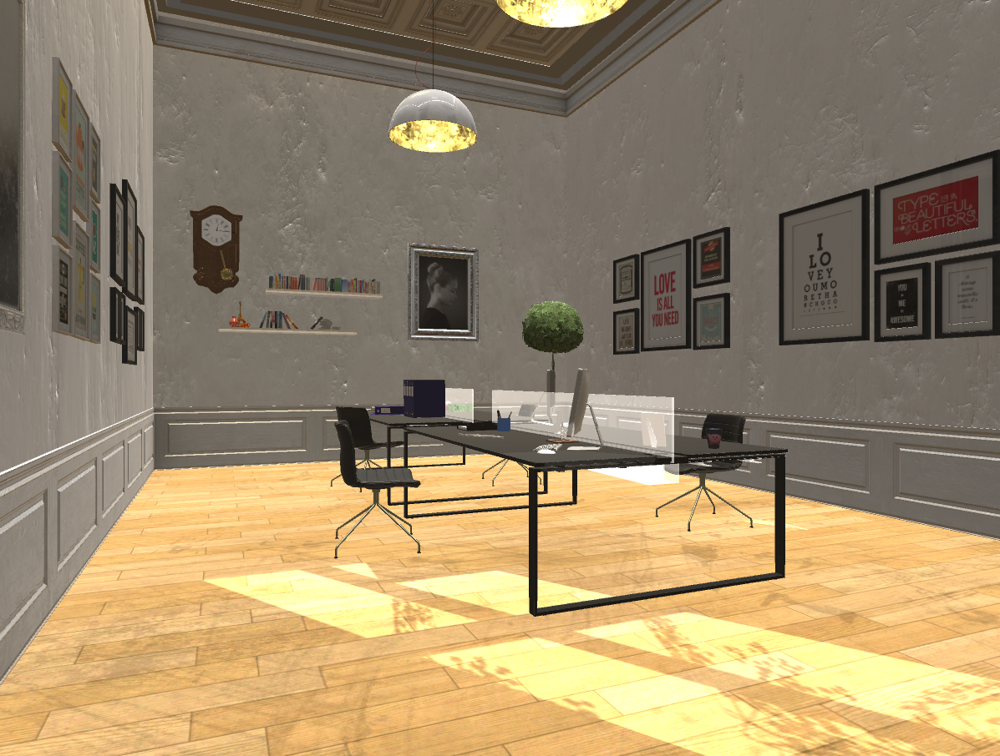

# Update List

### Version Semantics: 

    Major. Minor. isNotShaderCacheContained (1 if not Contained)

## 1.0 
> Add Basic Folder Structures

## 1.1

> Add Basic Wall Collider

> Add One Hinge Joint Door 

> Clear All Props from unityPackage Q512

> Sceen -> non-static

## 1.2 

> trying new space

Bugs require Fix:

* collider fix, 
* hinge joint fix, 
* wall fix

## 1.3

> fix collider 

> Hinge Joint not fixed yet

> Fill up new space

> Still non-static

Bugs require Fix:

	
* Hinge joint fix
* exit sign for upper cube of door(Maybe Ricgh Text UI will fix it)
* upper cube: Anchor override for two reflection probes with weights
* other area space bug

## 1.4

> fix room-Boiserie and Room-shelf bug(Shelf separate into two parts)

> Add windows.max for needs of boolean expression when adding windows

Bugs require Fix:

	
* Hinge joint fix
* exit sign for upper cube of door(Maybe Ricgh Text UI will fix it)
* upper cube: Anchor override for two reflection probes with weights
* other area space bug

## 1.5

> Complete partial office structure

> Still non-static

Bugs require Fix:

* Hinge joint fix
* exit sign for upper cube of door(Maybe Ricgh Text UI will fix it)
* upper cube: Anchor override for two reflection probes with weights
* other area space bug

	

## 1.6

> Fixed upper cube of the door

> Office Strcture minor Adjust

> Still non-static

Bugs require Fix:

* Hinge joint fix

	
## 1.7

> Add Props: Tray, Mug, KirbyMug, CupCake, Record Player

> Finish Section: Book Shelef of Office

> Still non-static

Bugs require Fix:

* Hinge joint fix

## 1.8

> Add Props: Spinning Top, Golden Laugh

> Try Add Reflection Probe Under top for top's reflection, however result is not good. Depreciated for now.

> Still non-static

Bugs require Fix:

* Hinge joint fix

## 1.9

> Add Props: Creeper Doll, Kirby Doll, Flowers, Mac Keyboard&Mouse

> Adjust Desktop structure

> Almost ready to start bake light

Bugs require Fix:

* Hinge joint fix

## 2.0

> Adjust Ceiling light

> trying add Fur Shader to Dools, but due to resouce-consuming depreciated.

> trying adjust material of spinning top, however it stay for original mat for now.

> Almost ready to start bake light

Bugs require Fix:

* Hinge joint fix // May Not Needed? <- if restrict access to other room?

## 2.1

> Adjust Wall Frames

> Almost ready to start bake light

Bugs require Fix:

* Hinge joint fix // May Not Needed? <- if restrict access to other room?

* Lack of Office Props on Haku's Desktop

## 3.0

> Lighting Baked

> Lots of workaround for beautify Scenes

Preview

Bugs require Fix:

* Lack of Office Props on Haku's Desktop

## 3.1

> Fix Position of Caffe Table, Console

> Adjust Exposure and Rotation of Skybox

Bugs require Fix:

* Lack of Office Props on Haku's Desktop

## 4.0 Merged

> Merge Project With M,P Version

Bugs require Fix:

* Lack of Office Props on Haku's Desktop

## 4.1 

> Note: Compressed With lightmap, ShaderCache, etc.

> Backup of new Lightmap

Bugs require Fix:

* Lack of Office Props on Haku's Desktop

* MKII Glow Shader Bug on d3d9x

## 4.2

> Import some of haku animation

> Build up simple demo of HeadLookController, BreathController

> HeadLookHelper is depreciated due to it may cause "The Exorcist"

> Adding Enviornment Compensation Light, Haku Compensation Light (Now Both are Directional Light with different Culling Mask)

Bugs require Fix:

* Lack of Office Props on Haku's Desktop

* MKII Glow Shader Bug on d3d9x

* Shadow of Realtime Direction Light Behavior really wierd (Just Like Silent Hills, WTF)

## 4.3

> Update Idle State Animation: Blending(Actually additvely blend) Animation of sitting.fbx from mixamo.com, trying syncing with BreathController

> Params:

	*	AvatarMask: Torse & two arms (NO HAND & IK)

	*	BreathController: Duration: 0.78

	*	AnimtaionController: BreathLayer: Additively, weight = 0.15

	*	AnimtaionController: BreathLayer.Delay -> BreathLayer.Breathing: Transition Duration = 0.25, Offset = 0

	*	AnimtaionController: BreathLayer.Breathing: Speed = 1

	*	Animtaion: sitting.fbx: frame 177 - frame 363 + AvatarMask

Bugs require Fix:

* Lack of Office Props on Haku's Desktop

* MKII Glow Shader Bug on d3d9x

* Shadow of Realtime Direction Light Behavior really wierd (Just Like Silent Hills, WTF)

## 4.4

> Adding Tracking target for HMD (Now Param: z = -1.93)

> Trying Blend Legs part with previous parts, However Foot Ik reacts wierd

	* 	Use 3ds max reconstruct Animation (So many works)

	*	However OL Haku's Heels won't move

	*	Temporaily change to Uniform Haku Instead

Bugs require Fix:

* Lack of Office Props on Haku's Desktop

* MKII Glow Shader Bug on d3d9x

* Shadow of Realtime Direction Light Behavior really wierd (Just Like Silent Hills, WTF)

* Considering use Uniform Haku Instead of OL Haku

## 4.5

> Finish Haku Office Animator: Leg Layer

Bugs require Fix:

* Lack of Office Props on Haku's Desktop

* MKII Glow Shader Bug on d3d9x

* Shadow of Realtime Direction Light Behavior really wierd (Just Like Silent Hills, WTF)

* Considering use Uniform Haku Instead of OL Haku

## 4.6

> Setup Haku Office Animator: UpperBody Layer

> Setup Randomly Leg Motion Script

Bugs require Fix:

* Lack of Office Props on Haku's Desktop

* MKII Glow Shader Bug on d3d9x

* Shadow of Realtime Direction Light Behavior really wierd (Just Like Silent Hills, WTF)

* Considering use Uniform Haku Instead of OL Haku

## 4.7

> Setup Simple grab object controll

Bugs require Fix:

* Lack of Office Props on Haku's Desktop

* MKII Glow Shader Bug on d3d9x

* Shadow of Realtime Direction Light Behavior really wierd (Just Like Silent Hills, WTF)

* Considering use Uniform Haku Instead of OL Haku

* UpperBody Randome motion script not finished

* Wall Collider needs to be fit exact space more

* Floor Collider needs to be fit exact space more

* Gravity: Due to the scene is two big, acts like moon

	* Shrink the scene

	* Override single scene gravity settings

* The place of rose should be adjusted

* The Scale of Camera Rig Should be adjusted

## 4.8

> Fix Gravity Bug

	* Gravity is propotion to scale 

	* Wierd AddForce after realeasing grab object is because I rotated [CameraRig]

> Update Simple give gift interaction

Bugs require Fix:

* Lack of Office Props on Haku's Desktop

* MKII Glow Shader Bug on d3d9x

* Shadow of Realtime Direction Light Behavior really wierd (Just Like Silent Hills, WTF)

* Considering use Uniform Haku Instead of OL Haku

* UpperBody Randome motion script not finished

* The scale of room props should be adjusted

## 4.9

> Update Basic Lunch Scene

Bugs require Fix:

* Lack of Office Props on Haku's Desktop

* MKII Glow Shader Bug on d3d9x

* Shadow of Realtime Direction Light Behavior really wierd (Just Like Silent Hills, WTF)

* Considering use Uniform Haku Instead of OL Haku

* UpperBody Randome motion script not finished

* The scale of room props should be adjusted

## 5.0

> Update Hurt Effect in Minecraft, Time countdown, etc.

> Update Game Control of Minecraft Scene

> Update Simple Whole Game Control

> Confirmed use Uniform Haku Instead of OL Haku

Bugs require Fix:

* Lack of Office Props on Haku's Desktop

* MKII Glow Shader Bug on d3d9x // One Workaround is to exclude direct9 on build setting

* Shadow of Realtime Direction Light Behavior really wierd (Just Like Silent Hills, WTF)

* UpperBody Randome motion script not finished

* The scale of room props should be adjusted

## 5.1

> Update Controller details

> I forgot what I've done :(

Bugs require Fix:

* Lack of Office Props on Haku's Desktop

* MKII Glow Shader Bug on d3d9x // One Workaround is to exclude direct9 on build setting

* Shadow of Realtime Direction Light Behavior really wierd (Just Like Silent Hills, WTF)

* UpperBody Randome motion script not finished

* The scale of room props should be adjusted

## 5.2

> Update Tutorial change image solution(hit.point to uv)

Bugs require Fix:

* Lack of Office Props on Haku's Desktop

* MKII Glow Shader Bug on d3d9x // One Workaround is to exclude direct9 on build setting

* Shadow of Realtime Direction Light Behavior really wierd (Just Like Silent Hills, WTF)

* UpperBody Randome motion script not finished

* The scale of room props should be adjusted

## 5.3

> ScreenFadeOut when changing scene (now only attached on Minecraft)

Bugs require Fix:

* Lack of Office Props on Haku's Desktop

* MKII Glow Shader Bug on d3d9x // One Workaround is to exclude direct9 on build setting

* Shadow of Realtime Direction Light Behavior really wierd (Just Like Silent Hills, WTF)

* UpperBody Randome motion script not finished

* The scale of room props should be adjusted

## 5.5

> Merged from ProjectHaku_P_Version5.4

> Construct Full Dropping gift script in Office Scene(All Gifts & after drop & detect drop with headLookController)

> Construct simple upper body animator (However random play script are not finished yet)

> Construct Planes that able to teleport

Bugs require Fix:

* MKII Glow Shader Bug on d3d9x // One Workaround is to exclude direct9 on build setting

* Shadow of Realtime Direction Light Behavior really wierd (Just Like Silent Hills, WTF)

* UpperBody Randome motion script not finished // almost done

* The scale of room props should be adjusted

## 5.6

> Finished Construct upper body animator

> Add Special Areas For haku to peek

Bugs require Fix:

* MKII Glow Shader Bug on d3d9x // One Workaround is to exclude direct9 on build setting

* Shadow of Realtime Direction Light Behavior really wierd (Just Like Silent Hills, WTF)

* Camera needs to higher?

* The scale of room props should be adjusted

## 5.8

> Merged from ProjectHaku_Y_Version5.8

> Finished Basic Crab Scene (including Morph Controll & revised anim, however not baked physics)

Bugs require Fix:

* MKII Glow Shader Bug on d3d9x // One Workaround is to exclude direct9 on build setting

* Shadow of Realtime Direction Light Behavior really wierd (Just Like Silent Hills, WTF)

* More less-important details are in todo.md

## 6.0

> Finished Crape and crab Lunch Scene

> Not quite sure waht updated in this version

Bugs require Fix:

* MKII Glow Shader Bug on d3d9x // One Workaround is to exclude direct9 on build setting

* Shadow of Realtime Direction Light Behavior really wierd (Just Like Silent Hills, WTF)

* More less-important details are in todo.md

## 6.2 ~ 6.2.8

> experiment with revised animations

Bugs require Fix:

* MKII Glow Shader Bug on d3d9x // One Workaround is to exclude direct9 on build setting

* Shadow of Realtime Direction Light Behavior really wierd (Just Like Silent Hills, WTF)

* More less-important details are in todo.md

## 6.4

> Revised Animations and fixing wierd bug when fast entering giving gift's collider, causing haku look at you while her hands still typing (Update: Ver 6.5 Not Fixed?)

Bugs require Fix:

* MKII Glow Shader Bug on d3d9x // One Workaround is to exclude direct9 on build setting

* Shadow of Realtime Direction Light Behavior really wierd (Just Like Silent Hills, WTF)

* More less-important details are in todo.md

## 6.5

> Add Basic Wedding Scene

> Spawn Camera on specific point by substract the placement between CameraRig & Camera(eye), However it works strange on office scene

> add experimental scene: Office Before Lunch

Bugs require Fix:

* MKII Glow Shader Bug on d3d9x // One Workaround is to exclude direct9 on build setting

* Shadow of Realtime Direction Light Behavior really wierd (Just Like Silent Hills, WTF)

* More less-important details are in todo.md

## 6.6.5

> Adjust BeforeLunchScene without physics effects on animation, a.k.a. broke meshes

> .5 is for haven't clean up experimental animations

Bugs require Fix:

* MKII Glow Shader Bug on d3d9x // One Workaround is to exclude direct9 on build setting

* Shadow of Realtime Direction Light Behavior really wierd (Just Like Silent Hills, WTF)

* More less-important details are in todo.md

## 6.7

> clean up experimental animations

> Adjust BeforeLunchScene

	裙子用bake，彎腰時破圖

	頭髮用MMD4Mecanim 的 Bullet Physics + MMDRigidbody 的 Cube

Bugs require Fix:

* MKII Glow Shader Bug on d3d9x // One Workaround is to exclude direct9 on build setting

* Shadow of Realtime Direction Light Behavior really wierd (Just Like Silent Hills, WTF)

* More less-important details are in todo.md

## 6.8

> Add Scene: Opening 

> Minecraft 全部串接 (計時倒數、GameStart/Over Canvas、creeper dying effects)，只缺ipad控制

Bugs require Fix:

* MKII Glow Shader Bug on d3d9x // One Workaround is to exclude direct9 on build setting

* Shadow of Realtime Direction Light Behavior really wierd (Just Like Silent Hills, WTF)

* More less-important details are in todo.md

## 6.9

> Add Tutorial Control in Scene:Minecraft

> Setting up Scene:Before Lunch

> Finish concat Scene:BeforeLunch and Scene:Lunch

> Trying setup Ending Scene for more details (Now Add: Canvas anim, camera change position)

> Force Rendering support to dx11 in windows, however MKGlow not fixed?

> Ignore dxd9d in some shaders(Axi) of ArchVizPRO

Bugs require Fix:

* Wierd physics are because of specialArea Collider in cameraRig?

* MKII Glow Shader Bug on d3d9x // One Workaround is to exclude direct9 on build setting

* Shadow of Realtime Direction Light Behavior really wierd (Just Like Silent Hills, WTF)

* More less-important details are in todo.md

## 7.0

> Finished Scene:BadEnding

> Construct Basic scene controll of Scene:GoodEnding, need testing and finish it with HMD on

Bugs require Fix:

* Wierd physics are because of specialArea Collider in cameraRig?

* MKII Glow Shader Bug on d3d9x // One Workaround is to exclude direct9 on build setting

* Shadow of Realtime Direction Light Behavior really wierd (Just Like Silent Hills, WTF)

* More less-important details are in todo.md

## 7.1

> Merge with Project_M_ver6.5, Adjust Scene:Office prop's scale

Bugs require Fix:

* Wierd physics are because of specialArea Collider in cameraRig?

* MKII Glow Shader Bug on d3d9x // One Workaround is to exclude direct9 on build setting

* Shadow of Realtime Direction Light Behavior really wierd (Just Like Silent Hills, WTF)

* More less-important details are in todo.md

## 7.2

> Finished Scene:GoodEnding (Not checked in VR)

Bugs require Fix:

* Wierd physics are because of specialArea Collider in cameraRig?

* MKII Glow Shader Bug on d3d9x // One Workaround is to exclude direct9 on build setting

* Shadow of Realtime Direction Light Behavior really wierd (Just Like Silent Hills, WTF)

* More less-important details are in todo.md

## 7.3

> Finished Scene:GoodEnding & Scene:BadEnding & Scene:Opening, Not including art details

> Add Scripting Control to bgm fadeIn/Out

Bugs require Fix:

* Wierd physics are because of specialArea Collider in cameraRig?

* MKII Glow Shader Bug on d3d9x // One Workaround is to exclude direct9 on build setting

* Shadow of Realtime Direction Light Behavior really wierd (Just Like Silent Hills, WTF)

* More less-important details are in todo.md

## 7.4

> Finished Bgm Controlling

Bugs require Fix:

* Wierd physics are because of specialArea Collider in cameraRig?

* MKII Glow Shader Bug on d3d9x // One Workaround is to exclude direct9 on build setting

* Shadow of Realtime Direction Light Behavior really wierd (Just Like Silent Hills, WTF)

* More less-important details are in todo.md

## 7.5

> FadeOut Bgm:EndingGoodWait

> 調整Minecraft Count Canvas

> 修正Office物理bug(果然是因為SpecialAreacapusle，調整physical detection layer 修正)

> 全部的bgm、音量再調整、Office Recorder

> 加入Lunch Ipad

> 修正SpawnAtPoint Bug: 因為CameraEye 和 CameraRig本身的Scale的引響(將CameraRig Scele 調成1解決，不過因此 Scene:Office 東西位置需要再微調)

> 修正 修正SpawnAtPoint Bug 之後地板會閃爍：拿掉 PlaneRefection就可以了(可能是之前改DXD9的關係)

> 修正 Minecraft CleanUp 沒有兩隻手把都啟用的bug

Bugs require Fix:

* MKII Glow Shader Bug on d3d9x // One Workaround is to exclude direct9 on build setting

* Shadow of Realtime Direction Light Behavior really wierd (Just Like Silent Hills, WTF)

* More less-important details are in todo.md

## 7.6

> Adjust Skirt

Bugs require Fix:

* MKII Glow Shader Bug on d3d9x // One Workaround is to exclude direct9 on build setting

* Shadow of Realtime Direction Light Behavior really wierd (Just Like Silent Hills, WTF)

* More less-important details are in todo.md

## 7.7

> LunchScene, EndingScene * 2 材質、光照完成！

	註記：無法看見蠟燭是因為跟背後玻璃的transparent相衝?

> Fix goodEnding CleanUp Bug

> Fix goodEnding SpawnAtPoint Bug

Bugs require Fix:

* MKII Glow Shader Bug on d3d9x // One Workaround is to exclude direct9 on build setting

* Shadow of Realtime Direction Light Behavior really wierd (Just Like Silent Hills, WTF)

* More less-important details are in todo.md

## 7.8

> Update Hint in Scene:Office

> Update Dialog Sprite in Scene:BeforeLunch & adjust time for changing scene

> Update Eaten effects on crape & crab(Add Donut)

Bugs require Fix:

* MKII Glow Shader Bug on d3d9x // One Workaround is to exclude direct9 on build setting

* Shadow of Realtime Direction Light Behavior really wierd (Just Like Silent Hills, WTF)

* Should add: Haku eating morph and SFXs

* Scene:Lunch LaserPointer Bug

* More less-important details are in todo.md

## 7.9

> Adjust Haku's scale in whole game

Bugs require Fix:

* MKII Glow Shader Bug on d3d9x // One Workaround is to exclude direct9 on build setting

* Shadow of Realtime Direction Light Behavior really wierd (Just Like Silent Hills, WTF)

* Should add: Haku eating morph and SFXs

* Scene:Lunch LaserPointer Bug

* More less-important details are in todo.md

## 8.0

> 修正 Vive Tutorial ReleaseObj 時給予velocity, augularVelocity 的問題(應該要用local座標系的速度、角速度)

	所以在此之後Camera可以Rotate了

> 建立API: 固定出生點視角 (根據 Start 時頭盔位置計算CameraRig轉動量，並根據旋轉之後位置重新指定位置)

> 尚未套用到Office以外的場景(最需要的應該是BeforeLunch)

Bugs require Fix:

* MKII Glow Shader Bug on d3d9x // One Workaround is to exclude direct9 on build setting

* Shadow of Realtime Direction Light Behavior really wierd (Just Like Silent Hills, WTF)

* Should add: Haku eating morph and SFXs

* Scene:Lunch LaserPointer Bug

* More less-important details are in todo.md

## 8.1 ~ 8.4

> 因為未詳細紀錄更新紀錄，所以直接整合在一起

> 紀錄上次更新API細節: 固定出生點視角 修正
	
	兩種做法：

	一為根據Camera轉動場景，在生成位置 但是這樣就無法static (舊的作法) // 不好

	二為根據位置計算CameraRig的轉動位移跟位置位移

> 修正新API之後 Ending 場景切換 Camera 位置

	因為轉動之後位移量不再是直接用加的，不過GoodEnding並未做視角控制，沿用舊版

> 初步 Bake 中，效果還好，但是

	光線在天花板處有明顯分界 // 應該是因為point light + 半圓燈罩? 正常嗎?

	沒有陰影的感覺 也沒有樹葉陰影的感覺

> 建立完整第0場景，修正移動到MenuBg的Bug

	因為下面的Plane 在手把的 TeleportMask中

	強迫完成教學的設計模式 (但是無法處理喜歡亂搞的玩家)

> 加入 GoodEnding 觀眾

> 加入Office Judge 禮物時轉頭

> 修正 Office 給東西動畫的bug (因為 Update UpperBodyMotion使用 IEnumerator，所以控制城拿東西後馬上被 Assign 回 Keyboard了)

> 修正複數Bug

	* 修正 Lunch LaserPointer Bug

	* 調整 Minecraft Canvas位置

	* Office 撿不到東西 // 沒問題啊?

	* Lunch 要離Haku進一點

	* Minecraft場景拿不到Ipad // 修改擺放位置

	* 調整 BeforeLunch Bgm 音量到 0.3 // 原本的兩倍

	* 修正BadEnding Haku表情 
	
	* Office表情慢一點點 // 因為加入轉頭

	* Haku頭髮Shader透明? // 因為貼圖本身那邊有alpha = 255的狀況，change MainTex to HairNT

	*  Office Keyboard 音效 // 不過沒有fadeIn, Out, 沒有很fit手指動作

> 註記：

	加頭髮 > 小穿越

	裙子物理沒有考慮到左右腳切換

	Idle -> take東西會小小穿越裙子 // 先不處理!

Bugs require Fix:

* MKII Glow Shader Bug on d3d9x // One Workaround is to exclude direct9 on build setting

* Shadow of Realtime Direction Light Behavior really wierd (Just Like Silent Hills, WTF)

* More less-important details are in todo.md

# 8.5 ~ 8.6

* 加入教學

* 加入 Minecraft Haku + ID

* 午餐音效等入

* 根據使用者回饋做了以下調整(以及修正bug)：

		Opening 教學場景 Canvas位置調整

		放寬ipad 中間頁面切換

		提示有的劍不能砍 -> 劍data Canvas

		天花板避免順移 -> 不過還是有無法避免的狀況

		午餐新增對話框 "那我們回去吧!" "你要吃嗎 我喂你"

		午餐Crape 位置 // 不調整

		Adjust 午餐Face Collider // 避免瀏海穿越到臉中

		拿掉 午餐胸前collider // 雖然說對側邊長瀏海有幫助，但是似乎對於後面馬尾影響過大

		Office Haku馬尾有點怪 (不過 BeforeLunch 不會? // 目前暫時拿掉，不過會不會是因為Dynamic Bone?

		Frame 位置調整 // 拿掉 Collider

		快速按下去留聲機會怪怪的? // 做relay 切換

		Office 頭髮穿透 // 重新調整椅子位置 Scale

		Office Haku 補償光 ++

		Ending固定在視角? // 暫不考慮

		修改Ending Canvas: 請在他身邊看著他

		Haku Wedding 太慢 // 把音樂fadeOut 割成 IEnumerator

		不放觀眾 // 暫時拿掉，有人反應很令人分心?

		ipad Coliider怪怪的? // 因為射線射到手把Controller，目前把cube size改成 (.7, .7, .7)

		修正 部分 Office 不應為 Static 的物件

		修正 GoodEnding / BadEnding SpawnPoint Bug

		加入 EndingScene 箭頭提示要看的方向 // 有點醜?

Bugs require Fix:

* MKII Glow Shader Bug on d3d9x // One Workaround is to exclude direct9 on build setting

* More less-important details are in todo.md

# 8.7

* 根據使用者回饋做了以下調整(以及修正bug)：

		 教學說明改成 "按下兩側的箭頭"

		 最後一頁 Hover

		 Minecraft 傳送門

		 拿起來才消失 劍Canvas

		 Minecraft fallback 回第一版地板

		 Tray 打光  //維持原樣

		 教學說明改成 "把禮物親手交給她"

		 修正 Office // 現在也會有RectileNo

		 Rectile Red warning // 原來是忘了assign texture

		 Opening Scene 加入 "試著移動看看" "試著抓取Ipad"

		 教學字體統一到 華康竹風體(P)

		 Minecraft放到最後多一頁 "PS 有些劍不能拿"

		 Office 時間長一點 // 180sec

		 Haku 電腦的圖, 自己電腦的圖

		 Frame 提示

		 咳嗽聲 自己吃的聲音 太小聲  咳嗽換回原本的版本, maleHamu pitch = 1.23

		 Lunch Loop 回去時考慮暫停Animator 跟 hamu音效

		 GoodEnding 光影閃爍  Haku身後的柱子  原因是因為realtime光，已拿掉

		 分數bug  Lunch IncScore 放在 Update

		 Office 送東西 Collider 偵測附上手把的雙重保險?  類似 Sword isGrabed的方式

		 午餐椅子的collider

		 苦力怕被擊退

		 修正 HurtCapsule 不自然的shader結果 // WorkAround

Bugs require Fix:

* MKII Glow Shader Bug on d3d9x // One Workaround is to exclude direct9 on build setting

* 以下不確定是否採納與修正：

		* Minecraft Canvas 此把劍無法傷害苦力怕

		* BeforeLunch Hair Collider修正

		* 晃很久苦力怕bug

		* Rectile bug?

		* 拿起東西的機制

* More less-important details are in todo.md

# 8.8

* 根據使用者回饋做了以下調整(以及修正bug)：

		 辦公室提示改成送其中一個禮物後消失

		 修改 Lunch Haku 肩膀動畫幅度

* 在 Minecraft 放入陀螺

* 修正 GoodEnding 中 Haku 的光影效果

* 拿掉 Minecraft場景中的布幔 // 在 Realtime 光影下有閃爍問題

* 修改Player Settings(ProjectName, Icon, Cursor)

* 調整 Lunch SFX 平衡

* 將Spinning Top 加上髮絲紋的法線貼圖

* 些微修正午餐頭髮的物理，但是依舊會抖動

Bugs require Fix:

* MKII Glow Shader Bug on d3d9x // One Workaround is to exclude direct9 on build setting

* 以下不確定是否採納與修正：

		* Minecraft Canvas 此把劍無法傷害苦力怕

		* BeforeLunch Hair Collider修正

		* 晃很久苦力怕bug

		* Rectile bug?

		* 拿起東西的機制

* More less-important details are in todo.md

# 8.9 ~ 9.0

* 修正 MKGlow Shader Error // 只是忘了上Glow貼圖?

* 導入新系統：Eye Raycast // Office 拿掉 Mune, yarashi Threshold 設成 150

* 根據使用者回饋做了以下調整(以及修正bug)：

		 * BeforeOffice/Office 桌子邊修正 // 弄新的Plane替代

		* 拿掉 Cursor (炸掉惹)

		* Office Desktop Props Scale 跑掉了 // 拿掉書

		* 修正 Office 筆筒位置

		* Office 天花板燈有點空虛 // 放 Point Light, 用 range + culling mask, 但是還是會有Distance問題

		*  Office Donut 位置上來一點點

		* Office Keyboard 聲音調小

		* BeforeOffice 陀螺應該要轉 // 直接拿掉陀螺

		* Ending要把 Keyboard 播放 cut 掉 // 直接volume Fade 到 0

		* Minecraft 陀螺位置

		* BadEnding BGM 有點小聲 // 調成 0.6

		* BadEnding Haku的腳要上面一點

		* Opening 沒有 RectileNo 效果? // 現在有了

		* Opening 教學 .5f 的 Delay // .3f更直覺，但是容易點太快

		* 修正 Minecraft 場景有時候拿不出劍 // 因為 CameraCollider, 用 Collision Layer 解決

		* 修正 Minecraft 場景 Hurt Effect Bug

		* 修正 GoodEnding Rectile Offset 太小

Bugs require Fix:

* More less-important details are in todo.md

# 9.1

* 裙子動畫修正

Bugs require Fix:

* More less-important details are in todo.md

